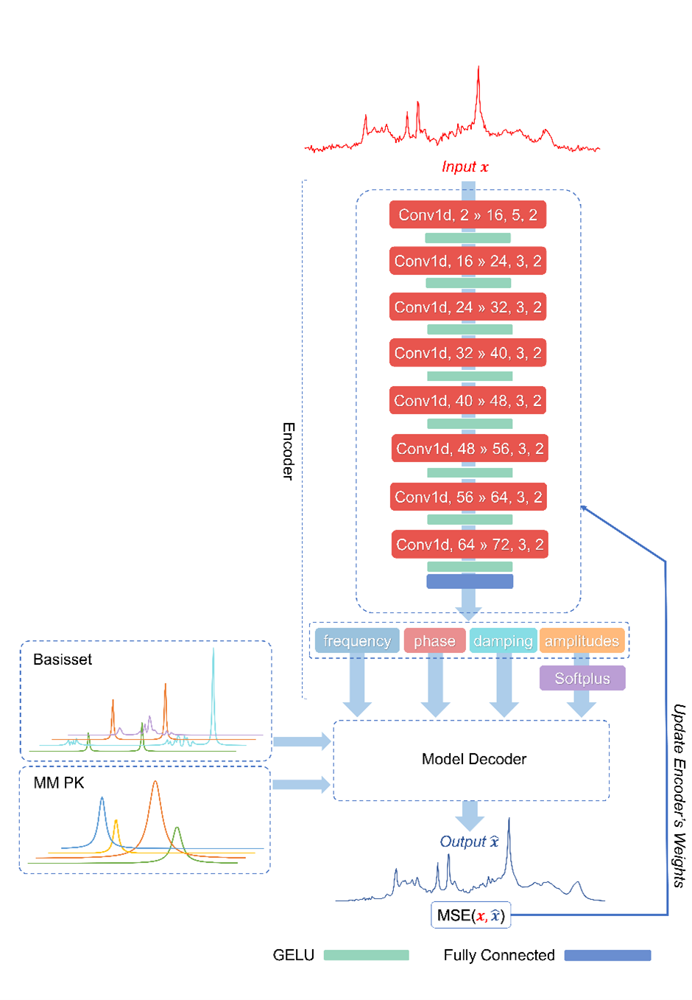
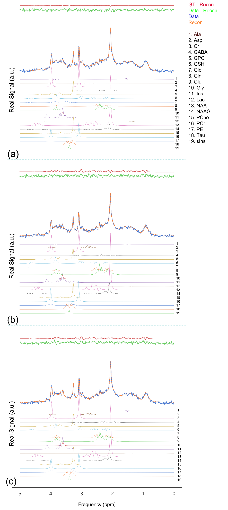
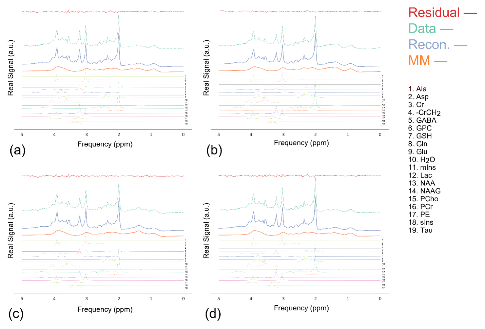

# Deep MRS Quantification
This repository provides the implementation of DeepFPC from the following paper:

Model-Constrained Deep Learning Approach to the Quantification of Magnetic Resonance Spectroscopy Data Based on Linear Combination Model Fitting: [Link to biorxiv](https://www.biorxiv.org/content/10.1101/2022.10.13.512064v1)

## How does it work?
- DeepMRS was implemented in Python with the help of the Pytorch lightning interface. 
- For each experiment, a "run" json file should be created. All parameters of the deep neural network and data can be stated in the json file.
There are examples of "run" json files that can be found in the "runs" folder.
- The network can be trained and tested simply by running "main.py". 
- Engine.py controls the pre and post-training steps for training and testing. dotrain() and dotest() are two functions for training and testing modes, respectively.
- Model.py is an object inherited from PyTorch lightning's "LightningModule". Now it contains four neural networks (ConvNet, MLPNet, mlp-Mixer, and ConvNext), but you can easily add your model.  Model-decoder are implemented in Model.py (forward function). 
------
## Proposed Deep Autoencoder for Deep Learning-based Peak Referencing
||
|:--:|
|Illustration of the proposed convolutional encoder–model decoder network. The input of the network is a complex signal \left(x\right) in the time domain, which is fed to the encoder. The encoder consisted of eight convolutional blocks and an FC layer. |
------
## Result
### Simulated
||
|:--:|
|Example spectra from the test subset of the simulated dataset quantified by (a) DQ-nMM, (b) DQ-pMM, and (c) DQ-rpMM. |
### GABA-edited in-vivo dataset([Big GABA](https://www.nitrc.org/projects/biggaba/))
||
|:--:|
| Four example spectra (a,b,c, and d) from the test subset of the Big GABAin vivo  dataset quantified by DQ-rpMM. |
-----
## Acknowledgments
This project has received funding from the European Union's Horizon 2020 research and innovation program under the Marie Sklodowska-Curie grant agreement No 813120.

## Citation
If you use this codebase, or otherwise found our work valuable, please cite:
```
@article {Shamaei2022.10.13.512064,
	author = {Shamaei, Amir M and Starcukova, Jana and Starcuk, Zenon},
	title = {Model-Constrained Self-supervised Deep Learning Approach to the Quantification of Magnetic Resonance Spectroscopy Data Based on Linear-combination Model Fitting},
	elocation-id = {2022.10.13.512064},
	year = {2022},
	doi = {10.1101/2022.10.13.512064},
	publisher = {Cold Spring Harbor Laboratory}
  }

```
